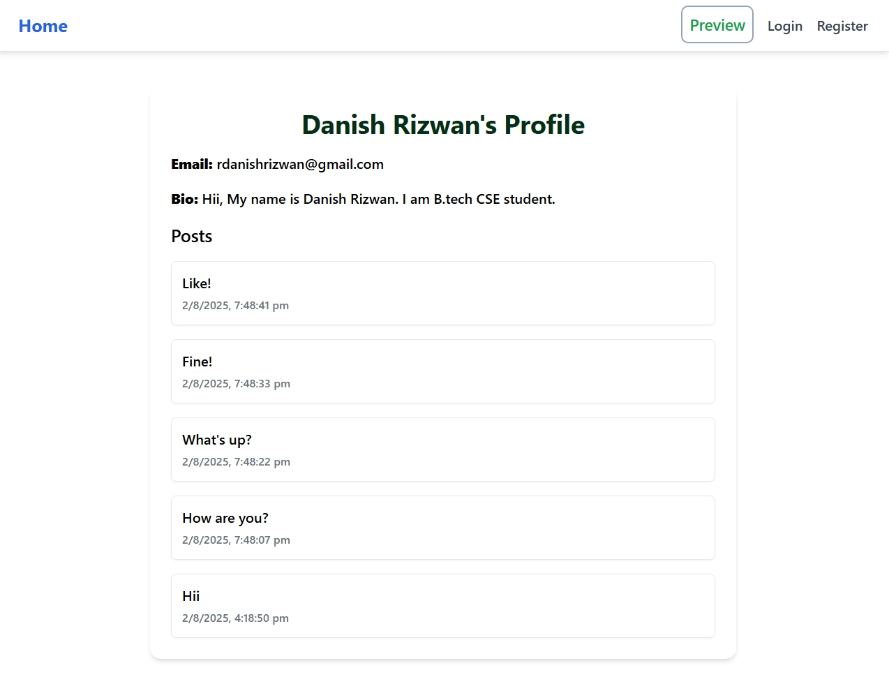

<h1 align="center" style="color:#2c3e50;">🌐 DevConnect</h1> <p align="center">  </p> <p align="center"> <b>A Mini LinkedIn-style MERN community platform for developers.</b><br> Connect with others, share posts, manage profiles — all in one space. </p>
📄 About the Project
DevConnect is a sleek and scalable MERN-based mini social network tailored for developers and students.
It enables authenticated users to create and view posts, update profiles, interact socially, and much more.

This platform offers a foundational model for learning full-stack development, social platforms, and secure user handling.

## 🌟 Features
# 🔐 User Authentication (JWT)
Secure sign-up, login, and session persistence.

# 🧑‍💻 Profile Management
View and update user details with optional profile image upload.

# 📰 Community Post Feed
See all public posts in a dynamic, real-time feed.

# ➕ Create, Edit, Delete Posts
Logged-in users can manage their own posts with ease.

# 🌈 Modern Responsive UI
Beautifully styled using Tailwind CSS and responsive across all screen sizes.

# 🔒 Protected Routes
Only authenticated users can access post creation, editing, or profile management.

# 📂 Image Upload (Optional)
Upload images for user profile or posts (easily extendable).

# 🚫 404 Page
Elegant “Page Not Found” screen for unknown routes.

# 🛠️ Tech Stack
This repository contains the full-stack implementation using the MERN stack.

⚛️ Frontend: React + Vite

🎨 Styling: Tailwind CSS

🔐 Auth: JWT-based Auth with Route Protection

🌐 Backend: Node.js + Express.js

🗃️ Database: MongoDB

# 🧪 Validation & Errors: Robust input validation & feedback handling

# 🚀 Live Demo
🌐 App Link: https://dev-connect-chi-khaki.vercel.app/

📁 Project Structure
```
devconnect/
├── frontend/                  # React + Vite Frontend
│   ├── src/
│   │   ├── components/      # Reusable UI components
│   │   ├── pages/           # Page routes (Home, Login, Register, etc.)
│   │   ├── services/        # Axios API services
│   │   ├── utils/           # PrivateRoute, error handling, etc.
│   │   └── main.jsx
│   └── index.html
│
├── backend/                  # Express Backend
│   ├── models/              # MongoDB models (User, Post)
│   ├── routes/              # Auth and post-related routes
│   ├── middleware/          # JWT, error handling, etc.
│   ├── controllers/         # Logic handlers
│   └── index.js             # Main server entry
│
├── .env.example             # Sample environment variables
├── package.json
```
⚙️ Getting Started
1️⃣ Clone the Repository
# Frontend
```
git clone https://github.com/rockyhans/DevConnect 
cd devconnect
```
# Backend
```
git clone https://github.com/rockyhans/DevConnect-backend
cd devconnect
```

2️⃣ Setup Environment Variables
Create .env files in both server directories.

Copy from .env.example and add your MongoDB URI, JWT secret, and server URLs.

3️⃣ Install Dependencies

# Backend
```
cd server
npm install
```

# Frontend
```
cd ../client
npm install
```
4️⃣ Run the Application

# Backend
```
npm run dev   # on http://localhost:5000
```

# Frontend
```
npm run dev   # on http://localhost:3000
```
📅 Project Status
This project is complete and ready for enhancement.


👤 Contributors
<table> <tr> <td align="center">  <br /> <sub><b>Danish Rizwan</b></sub><br /> <sub>Full-Stack Developer</sub> </td> </tr> </table>
📬 Contact
📧 Email: rdanishrizwan@gmail.com
